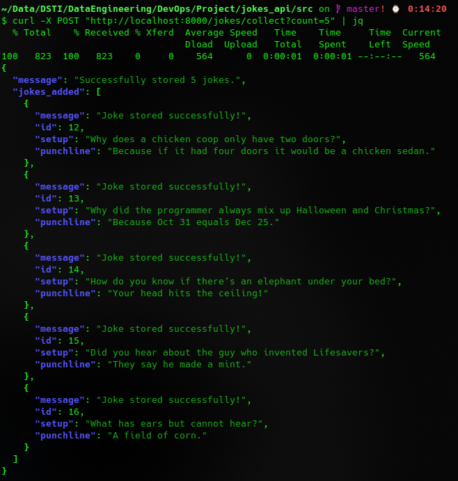
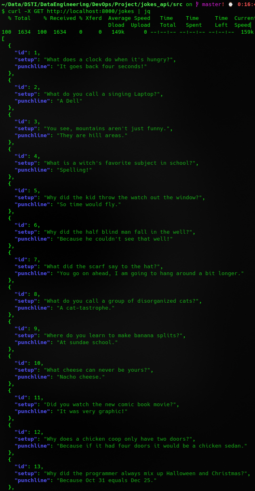
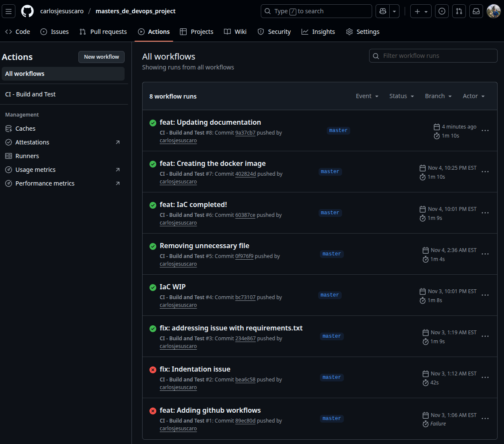
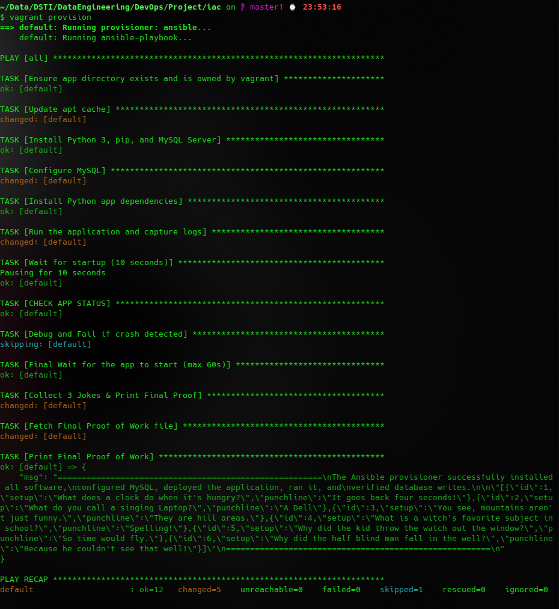
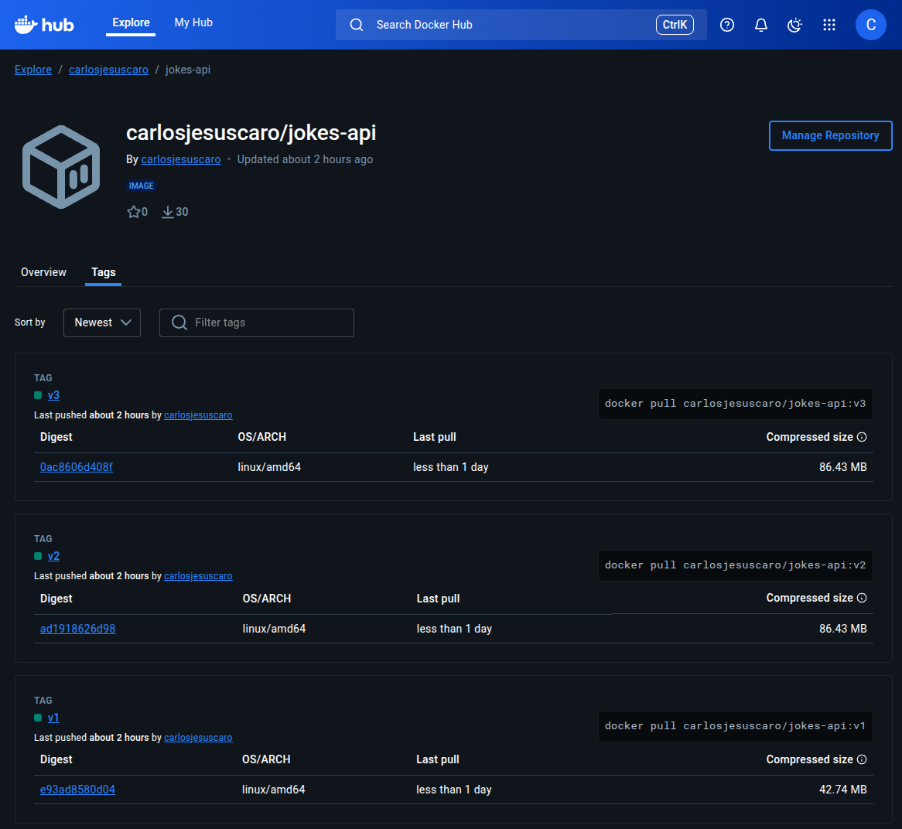
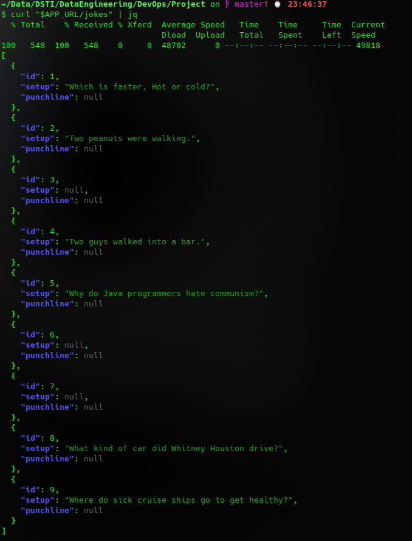

# Instructions

## Run the application locally

* From the project's root folder:

  * `source .venv/bin/activate`
  * `pip install -r requirements.txt`
* Running the application from `./jokes_api/src/`

  * `docker run --name local-mysql -e MYSQL_ROOT_PASSWORD=mysecretpassword -e MYSQL_DATABASE=jokedb -p 3306:3306 -d mysql:8`
  * `uvicorn main:app --reload`
* Using the application

  * [Browser - Main Page] - http://localhost:8000/
  * [Browser - Checking application health] - http://localhost:8000/health
  * [Terminal] - Pulling jokes from https://official-joke-api.appspot.com/random_joke by using the application `curl -X POST "http://localhost:8000/jokes/collect?count=5"`. 
  * [Terminal] - Pulling jokes that have been stored in the database `curl -X GET http://localhost:8000/jokes | jq`. 
* Running the test from `./jokes_api/src/tests/`

  * `pytest -v`
  * Github actions 

## IaC: Vagrant & Ansible

* From the directory `iac/`
* Command: `vagrant up --provider=virtualbox`
* 

## Kubernetes (Minikube)

### Docker image commands

* `docker build -t carlosjesuscaro/jokes-api:v1 .`
* `docker login`
* `docker push carlosjesuscaro/jokes-api:v1`
* Project image in DockerHub: [https://hub.docker.com/r/carlosjesuscaro/jokes-api/](https://hub.docker.com/r/carlosjesuscaro/jokes-api/tags)
* 

### Kubernetes commands

* `minikube start`
* `eval $(minikube docker-env)`
* `kubectl apply -f k8s/db-manifest.yaml`
* `kubectl wait --for=condition=ready pod -l app=mariadb --timeout=120s`
* `kubectl apply -f k8s/app-manifest.yaml`
* `kubectl rollout restart deployment jokes-api-deployment`
* `kubectl wait --for=condition=ready deployment/jokes-api-deployment --timeout=120s`
* `kubectl get all`
* `APP_URL=$(minikube service jokes-api-service --url)`
* `curl -X POST "$APP_URL/jokes/collect?count=3"`. 
  
* `curl "$APP_URL/jokes"`. 
  
